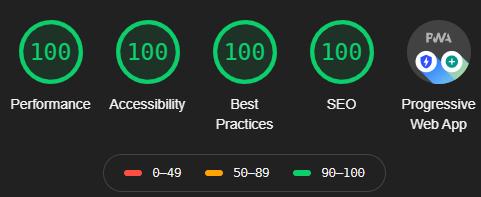

    

<h1 align="center">
 danielagiorgio.com
</h1> 

 My personal portfolio, built with <a href="https://www.gatsbyjs.org/" target="_blank">Gatsby</a> and hosted with <a href="https://www.vercel.com/" target="_blank">Vercel.</a>

## Tech ✨

- React
- Gatsby
- Styled Components
- Continuous integration with Vercel
- Goatcounter for analytics

## Lighthouse 🚀
 I achieved all 100's in Chrome Lighthouse Audit!
 
(If you run the audit, do it on incognito without any adblockers)
    

