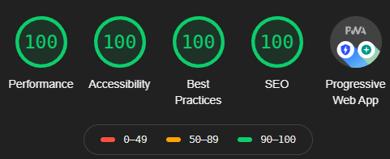

<p align="center">
    
</p><h1 align="center">
 danielagiorgio.com
</h1> 

<p align="center">
 My personal portfolio, built with <a href="https://www.gatsbyjs.org/" target="_blank">Gatsby</a> and hosted with <a href="https://www.vercel.com/" target="_blank">Vercel.</a>
  
</div>


### 👩‍💻 [Demo](http://danielagiorgio.com)


## ✨ Tech 

- React
- Gatsby
- Styled Components
- Continuous integration with Vercel
- Goatcounter for analytics


## 🚀 Lighthouse Audit Score
 I achieved all 100's in Chrome's Lighthouse Audit!
 
(If you run the audit, do it on incognito without any ad blocker extensions).
    


## 👷‍♀️ Installation & Set Up

### Pre requirements

 Git <br />
 Yarn or Npm <br />

1.  **Install the Gatsby CLI**

```
$ yarn global add gatsby-cli
```
   
2.  **Run the following commands**
```
$ git clone https://github.com/voirs/portfolio.git
$ cd portfolio
$ yarn
$ yarn develop
```
The site is now running at http://localhost:8000!

---

## 🎉 Building and Running for Production

1. **Generate a full static production build**

```
$ yarn build
```

2. **Preview the site as it will appear once deployed**

```
$ yarn serve
```

## 🤝 Contributing

Contributions, issues and feature requests are welcome. I always appreciate feedback! <br />
Feel free to check [issues page](https://github.com/voirs/portfolio/issues) if you want to contribute.<br />

## 📝 License

Copyright © 2021 [Daniela Giorgio](https://github.com/voirs).<br />
This repo is [MIT](https://github.com/voirs/portfolio/blob/main/LICENSE) licensed.
